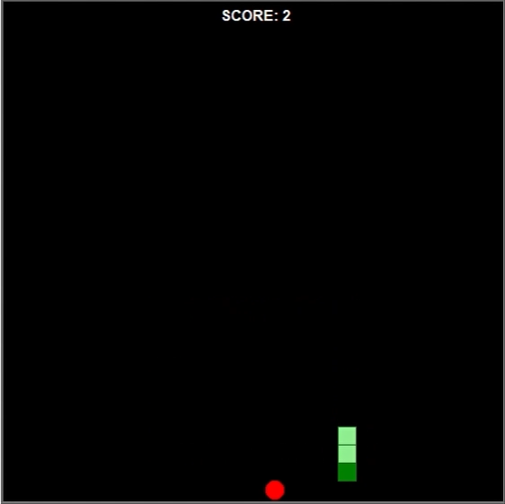

# The Snake Game App

Portfolio Game page link: [Acess Portfolio](https://meduardaeneves.github.io/portfolio/games/snake_game/)

  

This is a snake game app. Your goal is to move the snake using the keyboard arrows in order to reach the red element. 
  - Each time you succeed, you gain a point and the snake increases it's size.
  - The game ends once you bump into any of the four corners or any part of the snake.

To play the game you can download the .exe file (located in "files" folder) or download all the python files in this repository and execute it in your personal code editor.

